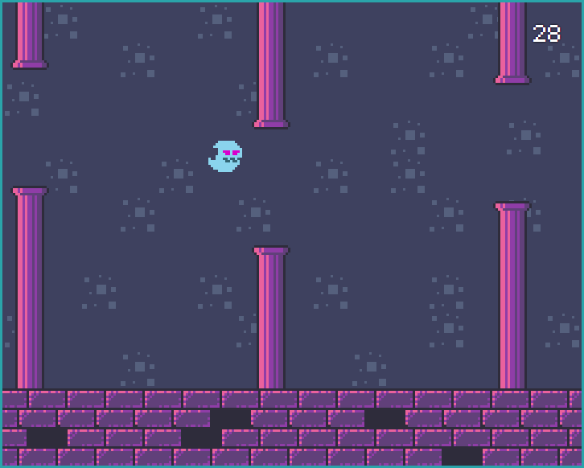

    <a href="http://floaty-ghost.web.app">
        
         
        <strong>(click me!)</strong>
    </a>

***

## :computer: Project

Floaty Ghost is a "Flappy Bird"-esque game developed with pure JavaScript in order to practice DOM manipulation.

Credit goes to both [Rotting Pixels](https://rottingpixels.itch.io/ "Rotting Pixels") and [Ansimuz](https://ansimuz.itch.io/ "Ansimuz") for the assets, and to [datagoblin](https://datagoblin.itch.io/ "datagoblin") for the font used in this project.

## :framed_picture: Screenshots

## :memo: License

This project in under the MIT License. Access [LICENSE](LICENSE.md) for more information.